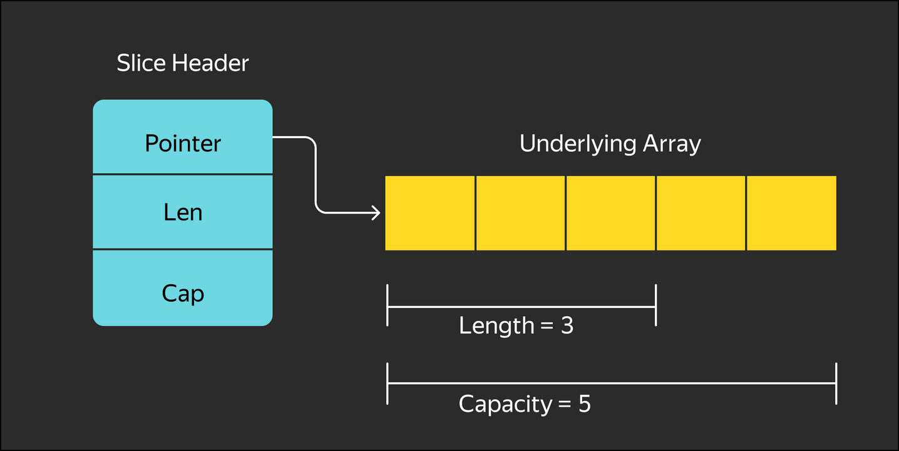

# Second lesson

## Arrays

Syntax:

```go
// declaration
var <name> [<length>]<type>

// initialisation
<name> := [length]<type> {array elements}
```

In Go, the number of elements in an array is a part of the type, i.e. arrays `[3]int` and `[5]int` belong to different types.

The compiler monitors the size of the initialization list, and it will not be possible to compile such a construction:

```
rgbColor := [3]uint8{1, 2, 3, 4} // array index 3 out of bounds [0:3]
```

The number of elements in the array can be output automatically based on the length of the initialization list. The following construction is used for this:

```go
rgbColor := [...]uint8{255, 255, 128} // [255 255 128] len = 3
rgbaColor := [...]uint8{255, 255, 128, 1} // [255 255 128 1] len = 4
```

Three dots indicate to the compiler that the size of the array should be derived based on the size of the initialization list.
Sometimes it becomes necessary to specify only one or more array elements in the initialization list, and leave the others untouched.
If you needed to specify the average daily temperature on Sunday, the code would hardly be pleased with its sophistication:

```go
thisWeekTemp := [7]int {0,0,0,0,0,0,11} // [0 0 0 0 0 0 11]
```

For large arrays, this would turn into an unreadable construct:

```go
var thisWeekTemp [7]int // [0 0 0 0 0 0 0]
thisWeekTemp[6] = 11 // [0 0 0 0 0 0 11]
```

However, only the necessary elements and their indexes can be specified in the initialization list. The index and value are separated by a colon:

```go
thisWeekTemp := [7]int {6:11, 2:3} // [0 0 3 0 0 0 11]
```

The size of the array can be obtained by the built-in `len` function. Since the size of the array is known at the compilation stage, the calculation of this function is replaced by a specific value during compilation.

If you try to access an array element beyond its size, the memory protection mechanism in Go will trigger and panic will begin. Unlike the C language, the Go compiler and runtime control going beyond the array, preventing access to invalid memory areas.

## Multidimensional arrays

Syntax:

```go
var <name> [<rows>][<columns>]<type>

var rgbImage [1080][1920][3]uint8
line := rgbImage[2]
pixel := rgbImage[2][3]
colour := rgbImage[2][3][1]
```

## Traversing array values

Example:

```go
var weekTemp = [7]int{5, 4, 6, 8, 11, 9, 5}

sumTemp := 0

for i:= 0; i < len(weekTemp); i++ {
    sumTemp += weekTemp[i]
}

average := sumTemp / len(weekTemp)
```
Go has a more convenient `for range` (the idiomatic equivalent of `for-each`) construct that allows you to traverse array elements sequentially without using additional variables:

```go
var weekTemp = [7]int{5, 4, 6, 8, 11, 9, 5}

sumTemp := 0

for _, temp := range weekTemp {
    sumTemp += temp
}

average := sumTemp / len(weekTemp)
```

The `range` operator returns the index and value of the next element in the array at each iteration.

**Note the following important point: the `_, temp := range weekTemp` construction creates a new `temp` variable, the type of which will be determined by the type of the array element.**

This variable will be assigned the next value from the array at each iteration of the loop. If you change the value of the `temp` variable, it will not affect the values in the array.

To access an array element, you will need an index:

```go
var weekTemp = [7]int{5, 4, 6, 8, 11, 9, 5}
for _, temp := range weekTemp {
   temp = 0
}
// weekTemp [5 4 6 8 11 9 5]
// if the value of the element is not used, you can omit the second variable
for i := range weekTemp {
   weekTemp[i] = 0
}
// weekTemp [0 0 0 0 0 0 0]
```

Array variables can be assigned to each other, but they must have the same type, and the number and type of elements must match.
During the assignment process, a complete copy of the array is performed, and if the program processes sufficiently large arrays of data, these copies can significantly slow down the program and increase memory consumption.
**Passing an array** (as well as a variable of any other type) to a function is copying its value to a variable of the function argument. There will also be a full copy here.

**There is another important point associated with the `for-range` loop — the `range` operand is copied to a temporary variable that is already being used for traversal.**

This can also slow down the execution of the program for arrays, so you should use pointer capture to avoid being idle:

```go
for i, temp := range &weekTemp {
    fmt.Println(i, temp)
}
```

### Advantages of using arrays

    - The array elements are always sequentially located in memory, which makes the processor happy and speeds up program execution.
    - Arrays have a fixed length, so the allocation of memory for an array occurs exactly once at the time of its declaration.
    - The access time to the array elements is minimal.
    - Go checks for going outside the array at the compilation stage if it can calculate the index value of an element at the compilation stage and during program execution. In the first case, there will be a compilation error, and in the second, there will be panic. It is better not to allow panic.

### Disadvantages of using arrays

    - Arrays can only be of a fixed length: if the number of elements is unknown to us in advance, we will have to allocate memory with a margin.
    - Arrays are transferred and assigned with a complete copy of the elements, which can lead to sudden performance degradation and increased memory consumption.
    - To process arrays of different sizes, you will have to write different functions (if generics are not used).

Arrays should be used very deliberately, when the size of your array is precisely known at the compilation stage. This allows you to speed up the program.
To fix the disadvantages of arrays, Go introduced slices.

## Slices

Since the length of an array is part of its type, arrays are not suitable for storing dynamic—sized data collections. This problem is solved by another type of data, which is much more often used in practice, slice.

In addition, the slice will save us from the problem of copying arrays for assignment.

A slice is a sequence of variable length consisting of elements of the same type. The slice type is written as an array type without specifying the size. You can initialize a "slice" type variable with values, but unlike an array, a variable without initialization is `nil`.

```go
var mySlice []int
```
A slice is very similar to a `list` in Python, but it has its own characteristics.
A slice is a wrapper over an array pointer, and in Go a slice is used as a structure of the following type:

    - the pointer to the first element of the base array is ptr;
    - slice length — len, the number of elements in the slice;
    - slice capacity — cap, the number of elements in the array.



The slice parameters `len` and `cap` can be obtained by calling the corresponding built-in functions `len()` and `cap()`.
If you simply declare such a structure, it will be equal to `nil`.

The built-in `make()` function is used to create a slice:

```go
    mySlice := make([]TypeOfelement, LenOfslice, CapOfSlice)
    mySlice := make([]int, 0)
    mySlice := make([]int, 5)
    mySlice := make([]int, 5, 10)
```

Arguments to the `make` function:

    - The type of slice (empty square brackets and the type of the slice element).
    - Slice length. If it is not passed, it is equal to zero by default.
    - The slice capacity is the size of the base array. If no value is passed, it defaults to the length of the slice.

The `make` function creates an array with a length of `cap` and writes a pointer to it into the slice structure. It also fills in the `len` and `cap` fields in this structure and returns it as a "slice" type variable.
Even if `len` and `cap` are passed as null, the structure itself will no longer be equal to `nil`. It will be allocated in memory, and the pointer to the base array will get a value other than `nil`.
If you pass the `cap` parameter less than `len` to the make function, a compilation error or a panic during execution will be caused.

A slice can be created from a composite literal in the same way as an array. The only difference is that we don't specify the size of the array:

```go
s := []int{1, 2, 3}  // [1 2 3]
```

The length and capacity of the slice will be equal to the composite literal.

A new slice can be created based on an existing slice or array. For this, the slice capture operation is used.
It is performed using two brackets with a colon `[i:j]`, where `i` is the index of the first element of the new slice, and `j` is the index of the next element **not included** in the new slice.

It is allowed not to specify `i` and `j`. In this case, `i` will be 0 by default, and `j` will be equal to the length of the array or slice.

Thus, `[:]` will return a slice of the entire array, `[:k]` — from the beginning to the kth element, `[k:]` - from the kth element to the end of the array.

`i` and `j` must be non-negative and no greater than `len`, with `i` being less than or equal to `j`. If these conditions are not met, a compilation error or panic will occur.

Consider an example:

```go
    weekTempArr := [7]int{1, 2, 3, 4, 5, 6, 7}
    workDaysSlice := weekTempArr[:5]
    weekendSlice := weekTempArr[5:]
    fromTuesdayToThursDaySlice := weekTempArr[1:4]
    weekTempSlice := weekTempArr[:]

    fmt.Println(workDaysSlice, len(workDaysSlice), cap(workDaysSlice)) // [1 2 3 4 5] 5 7
    fmt.Println(weekendSlice, len(weekendSlice), cap(weekendSlice)) // [6 7] 2 2
    fmt.Println(fromTuesdayToThursDaySlice, len(fromTuesdayToThursDaySlice), cap(fromTuesdayToThursDaySlice)) // [2 3 4] 3 6
    fmt.Println(weekTempSlice, len(weekTempSlice), cap(weekTempSlice)) // [1 2 3 4 5 6 7] 7 7
```
