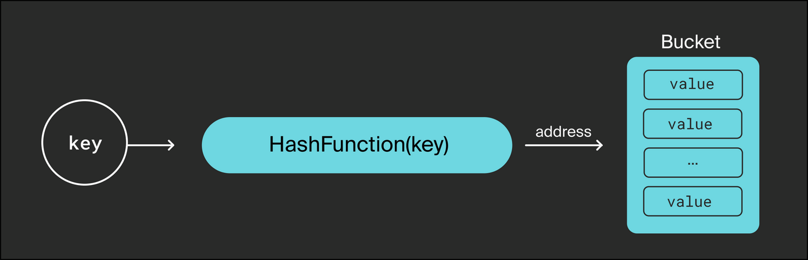

# Third lesson

## Maps

A **dictionary, an associative array, and a hash table** are common data structures in programming, which in many languages are embedded in the basic syntax, while in others they are implemented at the library level.

An associative array is a set of key-value pairs. You can assign the value `Map[key] = value` to the key, and then extract this value `value = Map[key]` by key. The keys are unique: only one value corresponds to one key.

The address of the value for the key is usually calculated by a hash function, so this data structure is also called a **hash table (hash map)**.

A **hash function** is any function that can unambiguously translate any passed value into a certain set of limited values. The convenience of using hash functions is that from an unlimited set of values, you can get values from a finite set. They can be used, for example, for array addresses.

The implementation of an associative array varies in different programming languages:

    - C++ is the `std::map` library class.
    - Python is the built—in `dict()` type.
    - PHP is the `Ds\Map` class.
    - Lua — `table`.



In Go, this data type is built into the basic syntax and is called a ***map***.

Example:

```go
m := make(map[string]string)
m["foo"] = "bar"
m["ping"] = "pong"
fmt.Println(m)
```

Output:

```
map[foo:bar ping:pong]
```

### Map declaration

Syntax:

```
var m map[KeyType]ValueType
```

The keys must be of the same type, and the values must be the same. However, the type of keys may not match the type of values.
In the Go language, `map` is a **reference type**, so declaring the `map` type alone is not enough.

For example, this code is compiled:

```go
var m map[string]string
m["foo"] = "bar"
```

But it will give an error during execution (run-time panic):

```
panic: assignment to entry in nil map
```

Variables of the `map` type are initialized using the `make()` function. The built—in `make()` function is a universal constructor of objects of a reference type.

```go
type MyMap map[string]string

var m1 MyMap
m1 := make(MyMap, 5)

// object is ready for use
m1["foo"] = "bar"
```

The type of the variable to be initialized is passed to the `make()` function with the first parameter. The function can optionally accept other parameters specific to the type being constructed. In the case of a `map`, this is the number of elements for which memory must first be allocated. There is no need to specify the exact amount needed for the initial memory allocation, and you don't need to pass this parameter at all.
If the number of items subsequently grows and no longer fits in the allocated memory, then additional memory will be allocated. Since memory allocation and garbage collection take time and require additional calculations, it is better to predict and specify the amount. The fact is that when adding new data to the `map`, memory is allocated with a reserve, and when this reserve runs out, a new memory allocation will be required.

Two variables of a reference type can point to the same object. For simple types, it looks like this:

```go
x := 5
y := x

x++ // x equals 6 when y is still 5
```

And for reference types — so:

```go
MyMap2 := MyMap1
MyMap1["foo"] = "bar" // now MyMap also has this key-value pair

MyMap2["foo" = "fizz" // now the key-value pair changed in MyMap1 too
```

### Composite literal

You don't have to declare the type of the variable, for example `string`, but just set the value literally:

```go
MyString := "this is my simple string"
```

The compiler itself will assign a type to a variable, construct an object, and assign a value.

This notation also works for complex types.
For map composite literal it looks like this:

```go
MyMap := map[KeyType]ValueType {key1: value1, key2: value2, ..., keyN: valueN,}

// for example
MyStringMap := map[string]string { "first": "1st", "second": "2nd",}
```

In this case, the composite literal creates a `map` without using the `make` function and already with initialized key-value pairs.

### Restrictions on key types

The `==` and `!=` operators must be defined for keys, so the key cannot be a function, hash table, or slice.

If you try to do this:

```go
var MyMap map[[]byte]string
```

then you will get a compilation error:

```
./prog.go:6:12: invalid map key type []byte
```

There are no restrictions on the type of values.

### Map syntax

```go
// to set the value for keys
m[key] = value

// to get the value of the map
v, ok = m[k]
v, ok := m[k]
var v, ok = m[k]
// in this case if key is in m, ok is true. If not, ok is false.

v = m[k] // in this case if m[k] exists it returns value otherwise - the null value of the type.

// Delete an element:
// delete(m, key)
```

If you do `m := make(map[int]int)`, do not fill in the data and still request the key value of 100 `v := m[100]`, the request will be processed and will return the value 0 (zero value for int type).
If we assign a value to the key 50 `m[50] = 0` and request it `v := m[50]`, the answer will be the same — 0.

These are two different cases.:

    - the key has not been assigned a value;
    - the key has been assigned a zero value.

To distinguish between them, it is better to use the full form of the index expression: `v, ok = m[k]`. Then the `ok` variable will take the value `true` if the key is found, and `false` otherwise.

Abbreviated forms of arithmetic operators will work here:

```go
m[k] += 2

m[k]++
```

You will not be able to get the address of the `map` element. This is because when adding new elements to the map, existing elements may be moved in memory. Pointers to these elements will become invalid. Therefore, such an operation is prohibited.

This code

```go
addr := &m[k]
```

will cause a compilation error:

```
cannot take the address of m[k]
```

### Built-in functions for the map type

Go has built-in functions for `map` operations.
The `len(m)` function returns the number of items in the table. It can also be applied to an uninitialized table for which the `make()` constructor has not yet been used, in which case `len(m)` returns `0`.

The `len()` function does not guarantee that the `map` is initialized. To make sure that you avoid a run-time panic, you can compare the table with a `nil`—zero value for the `map` type. And `nil` is the only value that `map` can be compared to. You cannot compare `map`'s with each other, because the `==` operator is not defined.

```go
var m map[string]string

if m != nil { // if not to check this condition
    m["foo"] = "bar" // you might have panic here
}
```

The `delete(m, k)` function deletes an element with the `key k` from the table `m`. The type of the key to be deleted must match the type of the map keys. If the table is not initialized or there is no such key in it, there will be no `runtime panic`, just `no-op`.

### Use in range loops

```go
m := make(map[string]string)
m["foo"] = "bar"
m["bazz"] = "yup"

for k, v := range m {
    // k is for keys
    // v is for values
    fmt.Printf("Key %v, has %v value\n", k, v)
}
```

If you run the loop on an uninitialized `map`, 0 iterations will be done.

If you need to change the values in a loop, it's worth remembering that it won't work that way:

```go
for k, v := range m {
    v = "here key "+k
}
```

If you need to modify the table, it's better to do this:

```go
for k, v := range m {
    m[k] = "here key "+k
}
```

***Go allows you to add and remove values to the `map` right inside the loop, during iteration. Deleted keys are guaranteed not to be included in subsequent iterations. There are no such guarantees with the added keys. The new key may or may not be included in subsequent iterations.***

This option is possible, but it is considered a bad habit:

```go
for k, _ := range m {
    delete(m, k)
}
```

The `_` variable is used in Go when the assignment operator sets several values, but not all of them are needed by the developer. However, you will have to provide a variable for the value, otherwise there will be a syntax error that the compiler will not miss. The developer provides the _ variable, which tells the compiler that it will not need the value and it does not need to be calculated.
In the case of for `range map`, it is acceptable to write for `k := range m`, that is, to provide only one iteration variable. You don't have to provide any at all: `for range m`.
A `map` is an unordered container, in the case of which the key traversal order in the `for loop` is not guaranteed and may differ in cycles of the same table. In addition, the `map` cannot be sorted.

### Concurrent access

Go is a multithreaded language. Multithreading is built into the basic syntax. When launching goroutines, remember that no built-in type in Go (except `chan`) is protected for access from multiple threads, and `map` is no exception.

***To safely use a map from multiple threads, protection mechanisms must be applied, otherwise data corruption or a race condition may occur. Recently, the standard library introduced a thread-safe version of an associative array, the equivalent of a [map](https://pkg.go.dev/sync#Map), which can be used in a multithreaded environment. Protection mechanisms are already built into this type.***
