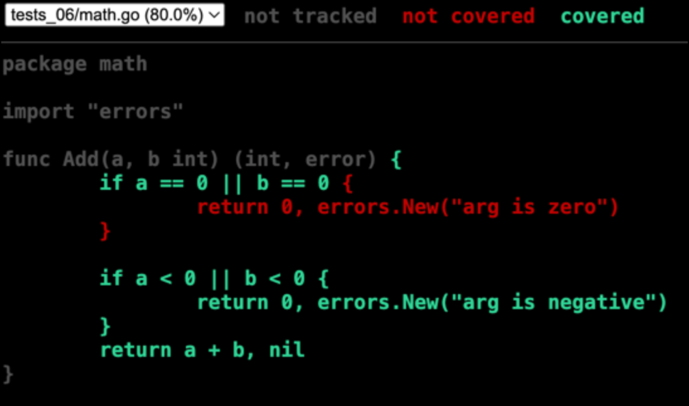

# First lesson

## Testing

In this topic, you'll learn about the basic testing capabilities of the Go ecosystem and work with the most popular testing library, `testify`.

You'll learn:

- What unit testing is;
- How to create and run tests for Go packages;
- How to determine code coverage;
- What testing patterns exist;
- Why mocks are needed and how to use them.

## Unit tests and code coverage

In this lesson, we'll cover how to test Go code using standard tools.
There are many types of functional and non-functional tests:

- **Unit tests** test a minimal portion of functionality (a function or method) in complete isolation from external dependencies. Essentially, they test individual small pieces of code.
- **Integration** tests test the interactions of several large parts of an application, such as ordering and payment systems.
- **End-to-end** tests test the functionality of the entire system.
- **Mutation tests** test the code for resilience to random changes.
- **Load tests** are used to determine the maximum load a system can withstand with an acceptable level of degradation.

***Recall that functional tests verify the functionality of the developed code, that is, its compliance with functional requirements. Non-functional tests (such as load tests) determine whether the code meets requirements for reliability, quality, maintainability, and so on.***

We'll focus on unit tests because:

- They're the easiest type of test to analyze.
- With the right approach to testing, they will make up the majority of the codebase.
- The techniques and methods demonstrated here can be used in other types of functional tests.

The Go language toolchain, which comes with the compiler, includes extensive testing tools. We'll focus on these.

### Where are unit tests located in Go?

In Go, all tests should be located in files with the `_test.go` suffix: for example, `user_test.go`. Unit tests are typically located next to the code being tested. The `user.go and user_test.go` files are typically located in the same directory.

`*_test.go` files aren't included in the final project build, so you can safely import large libraries like `stretchr/testify` into them.

However, when compiling tests, like the main code, cyclic imports are prohibited. However, when writing tests, they can often occur, since tests may require code that depends on the code being tested. In this case, the tests will depend on the code being tested and, therefore, import themselves. Therefore, tests are the only exception to the "one directory, one package" rule. Test files can be located in a package with the `_test` suffix—and it's best to take advantage of this.

The `_test` package should also contain code needed exclusively for tests. For example, you might want to make a private type public or add a class with helper methods. The auxiliary file (often called `harness_test.go` or `common_test`) might look like this:

```go
package user

import "context"

type UserDAO = userDAO

func (p *userProvider) ResetAllCaches(ctx context.Context) error {
// reset provider caches
}
```

### Tests in Go

Now that you know where and how to store test code, let's talk about how to write tests in Go.

In Go, all tests are functions of the form:

```go
func TestXxx(t *testing.T)
```

The `Test` prefix is required. `Xxx` typically specifies the name of the function being tested. Each function being tested can have multiple tests, in which case you need to provide additional information for each test.

For example, let's test the `Add` function, which should add two numbers, provided they are positive. If one or both numbers are zero, the function should return an error. `add.go` file:

```go
package math

import "errors"

func Add(a, b int) (int, error) {
    if a == 0 || b == 0 {
        return 0, errors.New("arg is zero")
    }

    if a < 0 || b < 0 {
        return 0, errors.New("arg is negative")
    }
    return a + b, nil
}
```

File `add_test.go`:

```go
package math

import "testing"

func TestAddPositive(t *testing.T) {
    sum, err := Add(1, 2)
    if err != nil {
        t.Error("unexpected error")
    }
    if sum != 3 {
        t.Errorf("sum expected to be 3; got %d", sum)
    }
}

func TestAddNegative(t *testing.T) {
    _, err := Add(-1, 2)
    if err == nil {
        t.Error("first arg negative - expected error not be nil" )
    }
    _, err = Add(1, -2)
    if err == nil {
        t.Error("second arg negative - expected error not to be nil" )
    }
    _, err = Add(-1, -2)
    if err == nil {
        t.Error("all arg negative - expected error not to be nil" )
    }
}
```

The `*testing.T` object provides access to several basic methods:

- `Error, Errorf` — writes a message to the error log and marks the test as failed. Test execution continues.
- `Fatal, Fatalf` — does the same, but terminates the test immediately. This method is often used in production projects for error handling. It is very useful for debugging when testing a specific section of code.
- `Skip, Skipf` — allows you to skip a test with a message. Used when the test environment is not specified. A typical scenario is running integration tests with an external service only on a CI system where it can be accessed.
- `Log, Logf` — allows you to output log messages internally. The advantage over the `fmt` package methods is that the log immediately shows which test the message refers to.
- `Run(name string, testf func(t *testing.T))` — runs a function as a test, which is convenient when running multiple test runs, for example, with different names.

### go test

Now let's look at running written tests. The Go ecosystem uses the standard [go test](golang.org/cmd/go/#hdr-Test_packages) utility for this. It allows you to run tests in the following ways:

1. Tests based on the code's location in a directory. To run all tests in a directory, simply navigate to it and run `go test` or `go test -v` . The `-v` flag redirects everything the tests log to `stdout` and `stderr` to `stdout`.
2. All tests in a package. To run all tests in a package, pass the `go test` utility the import paths of these packages, separated by spaces. For example: `go test math github.com/username/packagename github.com/username/packagename2`.
3. Tests matching a regular expression. It is also possible to test a subset of the package's tests. To do this, use the `-run` flag of the `go test` utility.

For example, if you want to test all test cases with the `TestFunc` prefix in the `github.com/ytuser/ytpackage package`, the `go test` command would look like this:

```
go test github.com/ytuser/ytpackage -run ^TestFunc
```

The argument is a regular expression that the test names must match.
However, regular expressions are beyond the scope of this tutorial, and if you're not familiar with them, it's best to read [this](https://habr.com/ru/articles/545150/) article first.

### Test Caching

If we re-run the `go test <PACKAGE_NAME>` command, we'll see that the command output has changed. In the case of the `math` package, we get:

```
ok    math    (cached)
```

This is because, in package testing mode, `go test` caches the results of test runs and, if the code and tests haven't changed, uses the cached results.

There are two ways to disable caching:

- Pass the `-count 1` flag, which specifies how many times each test should be run (the default is one). Therefore, `-count 1` doesn't change the number of runs (compared to the default value) but disables caching.
- Run the `go test clear` command, which clears the cache.

### Additional testing settings

- `-cpu 1,2,4` — Runs all tests multiple times using different numbers of threads. This is useful for testing parallel code and ensuring that it runs correctly on machines with different numbers of cores.
- `-list regexp` — Instead of running tests, `go test` will print the names of tests that match the passed regular expression to the console.
- `-parallel n` — Runs tests that call `t.Parallel` in their body in parallel.
- `-run regexp` — Runs specific tests.
- `-short` — If this flag is passed, `t.Short() == true`. In this case, you can either skip lengthy tests or reduce their functionality.
- `-v` — verbose logging. Even if the tests pass, their entire log will be output to the console.

### Code coverage

One of the most important code quality metrics is test coverage. In Go, this metric is calculated using the `-cover` flag of the `go test` utility. You can read more about this on the official Go [blog](https://go.dev/blog/cover).

For example, if you want to find out the test coverage of the `math` package from the standard library, you would run the `go test math -cover` command:

```
ok      math    0.003s    coverage: 86.8% of statements
```

Let's determine the test coverage of the Add function from the example above:

```
% go test -cover
PASS
coverage: 80.0% of statements
ok      tests_06        0.233s
```

But knowing just one metric is often insufficient, and it's necessary to determine which lines of code were not used during test runs. This functionality is also included out of the box in the form of the `-coverprofile` flag of the `go test` utility and a dedicated [go cover](golang.org/cmd/cover/) utility for analyzing test coverage profiles.

So, if you want to find out which specific code in the `math` package wasn't covered by tests, you need to do the following:

1. Run the `go test` utility on it and save a test coverage profile file. The path to the profile file is the value of the `-coverprofile` flag. In this case, we'll save it to the `coverage.out` file in the current directory:

```
go test . -coverprofile=coverage.out
```

2. Analyze the resulting file with the `cover` utility. For example, using the compiled profile, you can get an HTML representation of the source code with additional markup related to test coverage:

```
go tool cover -html=coverage.out
```

After execution, a browser will automatically launch, displaying the coverage information.



### Convenient testing

You can test code using just `*testing.T`, but it doesn't provide access to features like checking for equality, checking for an error return, or checking for panic when a passed callback is called.

This gap is being filled by third-party libraries, the most popular of which is [testify](https://github.com/stretchr/testify). It's worth noting that these libraries aren't a replacement for standard `testing`, but rather extend and complement it.

testify is a Swiss army knife in the world of Go code testing. So, let's talk about the frequently used packages from this repository separately.
[assert](https://pkg.go.dev/github.com/stretchr/testify/assert){target="_blank"} — a package that contains many convenient functions with descriptive names, like assert.Equal or assert.Nil. It's designed for use inside regular Go tests like func TestXxx(t *testing.T) (we'll talk about more unusual ones when we get to suite).
[require](https://pkg.go.dev/github.com/stretchr/testify/require) — the same as assert, but if the assertions in this package fail, the test execution stops. This means that Fatal is used internally instead of Error.
- suite — a package that introduces the concept of a test suite. If you've worked with tests in Java or Python, you're likely familiar with it.
