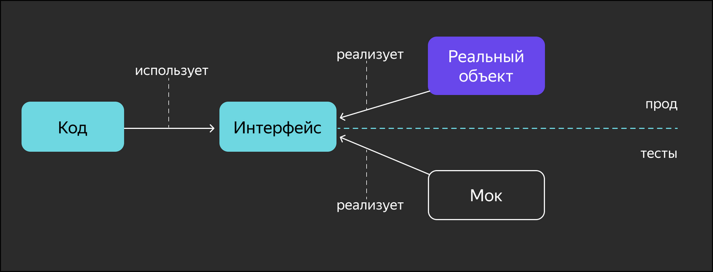

# Second lesson

## Interfaces in Testing

In previous lessons, you explored various approaches and methodologies for software testing. In this one, you'll learn how **mock** testing works and why it's important.
When working with mocks, an object is created that's accessible from the outside just like a real one, but the developer has complete control over its behavior. This object is called a mock.

***Mock testing is especially convenient in Go thanks to the concept of interfaces. Essentially, all that's needed to create a stub object is to satisfy the interface of the real object. Other OOP languages, such as Python or Java, also support mock testing, but it can be more difficult with complex inheritance hierarchies.***

This is useful when:

- only the business logic needs to be tested;
- processes take a lot of time and can be saved through testing;
- it's impossible or undesirable to perform a certain operation during testing, such as sending emails or notifications;
- it's impossible to deploy a copy of the database or it's a black box;
- it's difficult to test required states in external data sources, and it's easier to establish the necessary boundary conditions using mocks.



The easiest way to understand how mocks work is with an example.
Suppose you have a database that can't be used for testing, but you want to verify that the code you've written to work with it works correctly. Let's take the simplest case: a database package has a `DB` type and a method for checking the existence of a user by their email address. The `UserExists` method returns `true` if a user with the specified email address exists, and `false` otherwise.

```go
func (db *DB) UserExists(email string) bool
```

In previous topics, we discussed the concept of an interface type, which describes only the behavior (methods) of an object. Its structure and internal implementation are irrelevant—we can describe a set of methods for working with the database as an interface.
In production, we'll use a type that connects to the database and sends queries, and for testing, we'll create a type with the same methods, which we can call to compare the results with reference values.

```go
type DBStorage interface {
    UserExists(email string) bool
}

// note that DBStorage is passed to function as a param so we could substitute the real bd with test mock
func NewUser(db DBStorage, email string) error {
    if db.UserExists(email) {
        return fmt.Errorf(`user with '%s' email already exists`, email)
    }
    // add recording
    return nil
}
```

Here, the `DBStorage` interface type and the `NewUser` function are defined, which checks for the existence of a user with the same mailbox. In production, we'll call this function on a `DB` variable, but now we'll write a test for it.
If there are multiple test cases, it's best to use tables (**table-driven tests**) with input data and expected results for testing:

```go
import (
    "github.com/stretchr/testify/require"
)

// type of mock obj
type DBMock struct {
    emails map[string]bool
}

// to satisfy the interface type DBStorage implement
func (db *DBMock) UserExists(email string) bool {
    return db.emails[email]
}
// supportive method for slippling test data
func (db *DBMock) addUser(email string) {
    db.emails[email] = true
}

func TestNewUser(t *testing.T) {
    errPattern := `user with '%s' email already exists`
    tbl := []struct {
        name    string
        email   string
        preset  bool
        wanterr bool
    }{
        {`want success`, `gregorysmith@myexampledomain.com`, false, false},
        {`want error`, `johndoe@myexampledomain.com`, true, true},
    }
    for _, item := range tbl {
        t.Run(item.name, func(t *testing.T) {
            // create mock obj
            dbMock := &DBMock{emails: make(map[string]bool)}
            if item.preset {
                dbMock.addUser(item.email)
            }
             // execute our code passing mock obj
            err := NewUser(dbMock, item.email)
            if !item.wanterr {
                require.NoError(err)
            } else {
                require.EqualError(t, err, fmt.Sprintf(errPattern, err.email))
            }
        })
    }
}
```

In the `TestNewUser` test function, we check the return value of the `NewUser` function depending on whether a user with the specified email address exists. This way, we can test the behavior of our function without accessing a real database. In the example, we create a mock for each iteration and, if necessary, add an email address to it to test various options.

Mocks can be used not only to substitute operations but also to obtain detailed information, such as the number of function calls, parameter control, and so on. To do this, simply add the required fields to the stub structure and modify them with each call to the interface method:

```go
type DBMock struct {
    emails  map[string]bool
    counter int
}

func (db *DBMock) UserExists(email string) bool {
    db.counter++
    return db.emails[email]
}
```

So, we've covered the general principles of mocks, which provide additional capabilities for software testing. In simple cases, you can create such tests yourself, but in practice, it's better to use ready-made mock testing libraries:

- [testify/mock](github.com/stretchr/testify);
- [golang/mock](https://github.com/golang/mock);
- [vektra/mockery](https://github.com/vektra/mockery).

## Additional materials

- [GoMock vs. Testify: Mocking frameworks for Go](https://blog.codecentric.de/2019/07/gomock-vs-testify/)

- [Mock Solutions for Golang Unit Test](https://laiyuanyuan-sg.medium.com/mock-solutions-for-golang-unit-test-a2b60bd3e157)
