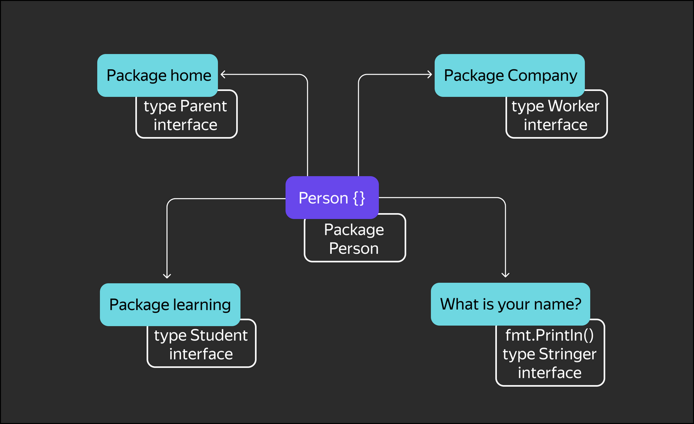

# First lesson

## Interfaces

In this topic, you will:

- learn the syntax for defining and implementing interfaces;
- learn some best practices for using interfaces.

## The concept of interfaces and their implementation

In Go, an interface is a set of methods that can be implemented by a type. In other words, an interface is a description of what a type can do.

If a type has the methods described in the interface, then that type satisfies the interface.
The syntax of an interface is very simple. Here's an example of an interface. Note that an interface is described as a type:

```go
type MyInterface interface {
    Method1(int) int
    Method2(a string) string
    //.... could be a lot more methods
}
```

The method name, a list of its arguments, and return values are specified in curly braces. Argument names can be omitted, so specifying the type is sufficient. However, for better code understanding, it's better to write them out: the description of the `Create(id int, name string, email string) bool` method is clearer than `Create(int, string, string) bool`, even though these methods are formally identical.

An interface describes a contract between different parts of a program. By passing a variable to different parts of the program, we describe the methods expected from this variable.
The main purpose of interfaces is to implement polymorphism: on the one hand, a type can implement several interfaces in different contexts of use, and on the other hand, we have the ability to write algorithms that work with different data types.

Let's give a simple example. Imagine we have a `Person` structure that describes a person. In different areas of life (and in our program), a person can play different roles: for example, a student, an employee, a parent, and so on. For a particular area, their role in other areas is irrelevant. At work, they're expected to work, and at school, they're expected to turn in homework. As a parent, they can share information about their children. They can also share information about themselves.
Let's describe these relationships in code:

```go
package person

// Person - structure that describes human
type Person struct {
    name string
    homework string
    children []*Person
}

// DoHomework — do homework
func (p Person) DoHomework() string {
    return p.homework
}

// Children — provide info about children
func (p Person) Children() []*Person {
    return p.children
}

// Work — do work
func (p Person) Work( tasks []string ) string {
    s := p.name + " work:"
    for _,task :=  range tasks {
        s += "\n I do " + task
    }
    return s
}

// String — provide info about self
func (p Person) String() string {
    return p.name
}
```



Naturally, these methods don't need to be present in different parts of the program simultaneously. Furthermore, calling them could disrupt the program's normal operation.

As an example, let's describe another package representing a workspace:

```go
package company

// Worker — employee interface
type Worker interface {
    // All he must be able to do - to work
    Work(tasks []string) string
}

// Company — company structure
type Company struct {
    // personal — employees of company
    // note that we have created a slice of the company's employees, that is, a slice of variables of the Worker interface type
    personal []Worker
}

// Hire — hiring a new employee
// An employee can be of any type: human, robot, or guard dog. The main thing is that they are able to work, that is, satisfy the Worker interface.
// Go checks at compile time whether the passed variable conforms to the interface
func (с* Company) Hire( newbie Worker ) {
    с.personal = append(с.personal, newbie)
}

// Process — work of the specific employee
func (с Company) Process ( id int,  tasks []string) (res string) {
    return c.personal[id].Work(tasks)
}
```

***Note***: Person isn't explicitly stated to implement the Worker interface. Again, duck typing is a good idea: if it looks like a duck, swims like a duck, and quacks like a duck, then it's a duck.

This is the essence of polymorphism. A company can work with different entities, the only requirement being that they can work together. This requirement is described through an interface.

Now let's unite these packages together:

```go
package main

import (
    "company"
    "person"
)

func main() {
    pers := person.Person{}
    comp := company.Company{}

    comp.Hire(pers) // we pass variable of Person type to the function which accepts args with type Worker!
}
```

At compile time, the compiler checks whether a `person` can be assigned to a variable of type `Worker`. This is done by checking that the `Person` type has all the methods of the `Worker` interface. In our case, they do, and everything works.
Using interfaces, we can write code that is abstracted from external modules: changes to them don't require rewriting your code, and vice versa.

Interfaces add flexibility and reduce code coupling. The `person` and `company` packages don't know anything about each other, but they can interact successfully.

Let's continue with our example.
Suppose we decide to add robots to our program that can work just like humans:

```go
package robot

import "fmt"

// Robot — robot type
type Robot struct {
    model       string
    serialId    int
    workCounter int
}

func (r Robot) String() string {
    return fmt.Sprintf("Robot %s serialID %d", r.model, r.serialId)
}

// Work — the robot performs work and remembers the number of completed tasks. Therefore, the method receiver is by pointer
func (r *Robot) Work(tasks []string) string {
    res := fmt.Sprintf("%s work:", r)
    for _, task := range tasks {
        res += "\n I do " + task
    }
    r.workCounter += len(tasks)
    return res
}
```

Since the `*Robot` type implements the `Worker` interface, it is possible to employ a robot in a company.

***Note***: from Go's perspective, the `Robot` and `*Robot` (pointer) types are different. In the example, the `Work` method is bound specifically to `*Robot`. Since the `Robot` type doesn't formally implement the `Worker` interface, the following code won't compile:

```go
comp := company.Company{}

robo := Robot{};
comp.Hire(robo);
```

So we'll use a pointer to the robot. Indeed, this makes sense. Since working for the company changes the robot's internal state, we need to pass a pointer to it.

```go
comp := company.Company{}

robo := &Robot{};
comp.Hire(robo);
```

This code will compile fine. Note that nothing had to be changed within the company itself. We simply created robots that met all of its employee requirements. If the company had been working with structures, we would have had to create separate methods for working with robots and with people.

## Interfaces and External Library Code

Now that you know the syntax for defining and implementing interfaces, let's look at some practical uses.
Since Go doesn't require you to explicitly specify that a type implements an interface, you can write your own interfaces for library code.

Let's say you're using a ready-made library that makes network requests to an API:

```go
type BigAPIClient struct {
    // skip code
}

func (c *BigAPIClient) Connect() error {
    // ...
}

func (c *BigAPIClient) Close() error {
    // ...
}

func (c *BigAPIClient) FetchMessages() ([]Message, error) {
    // ...
}

func (c *BigAPIClient) SendMessage(email string, message string) error {
    // ...
}

func (c *BigAPIClient) SendStatus(status string) error {
    // ...
}
```

Let's say your code only needs two methods. If you want to test integration with this library, you don't need to change anything. In Go, you can easily replace type method calls with interface method calls:

```go
type Client interface {
    FetchMessages() ([]Message, error)
    SendMessage(email string, message string) error
}

func MyFunc(client Client) {
    // in the parameters, instead of the *BigAPIClient type, we accept the Client interface
    // the function code and the calling code remain unchanged
    messages, err := client.FetchMessages()
    if err != nil {
        // ...
    }

    // ...
}

func main() {
    client := &BigAPIClient{}
    MyFunc(client)
}
```

Let's write a test stub to test the integration.

```go
type MockClient struct {
}

func (c *MockClient) FetchMessages() ([]Message, error) {
    return []Message{{Text: "привет"}, {Text: "тестовый пример"}}, nil
}

func (c *MockClient) SendMessage(email string, message string) error {
    // ...
}
```

Now the function works equally well with both library methods and substituted test methods:

```go
func main() {
    realClient := &BigAPIClient{}
    MyFunc(realClient)

    mockClient := &MockClient{}
    MyFunc(mockClient)
}
```

***Note***:
You might encounter the following construct in library code:

```go
var _ Client = (*MockClient)(nil)
```

This line adds an explicit check to see if the `MockClient` type implements the `Client` interface. If this type doesn't conform to the interface specification, the code won't compile. This construct allows for this check to be performed before any code using this type is written.

## Interfaces should be compact

In Go, it's common practice to keep interfaces as small as possible. The simpler the interface, the easier it is to understand the code. If an interface has more than 5-10 methods, it's time to split it.
A good practice is to declare an interface with even just one method. Such interfaces are often named after the method and appended with the suffix `-er`.

```go
type Stringer interface {
    String() string
}
```

## Interface Composition

An interface description can not only list methods, but also embed existing interfaces—they can be combined:

```go
type Reader interface {
    Read(p []byte) (n int, err error)
}

type Writer interface {
    Write(p []byte) (n int, err error)
}

type FileHandle interface {
    Reader
    Writer
    Close() error
}
```

As a result, the `FileHandle` interface will contain three methods: `Read, Write, and Close`.

Interface composition is a very important and easy-to-use feature. It allows you to embed the requirements of another interface, including interfaces from other packages, into an interface. For example, if a company plans to send all its employees to training, it can simply embed the `Student` interface into the `Worker` interface. The company may not know what requirements the `Student` interface defines, but it delegates responsibility for this to its employees.

## Key Points

- An interface is a Go language type that describes not the structure of a variable, but its behavior.
- Implementing an interface means creating a type that implements the behavior described by the interface.
- An interface variable can be assigned an object of any type as long as it satisfies the interface.
- From a language perspective, the types T and *T are different.
- An interface is declared in the package in which it is used and is part of its contract for external packages that implement it.
- Interfaces help reduce code coupling.
- Interfaces enable polymorphism and object-oriented programming (OOP) hiding.
- Interfaces can be combined.
- You can also write your own interfaces for library code.
