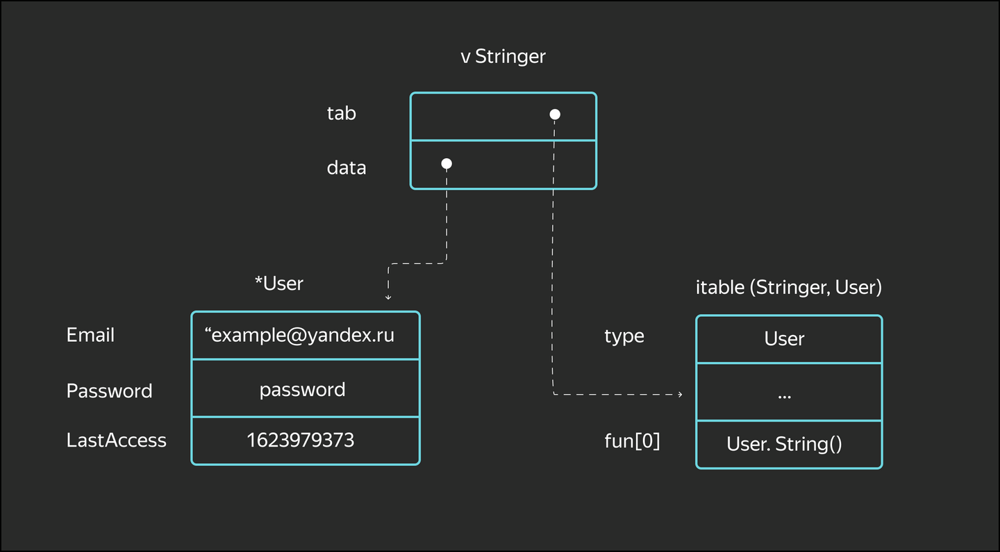

# Third lesson

## Empty interface and type casting

In previous lessons, interfaces were used in defining functions and structures. However, there are situations where it's not always possible to specify specific variable types. For example, if we receive a JSON document from a user, the document's structure could be anything.

You can allow a function to accept an arbitrary parameter using an **empty interface** — an interface without methods.

Indeed, since an interface is a set of requirements for a type, an empty interface requires nothing from the type. It can be anything. However, it's also impossible to use a variable of the empty interface type.

```go
func PassAnyType(v interface{}) {
    // ...
}
```

***Note***: In Go 1.18, the `interface{}` type received a shorter and more understandable alias, `any`.

But nothing can be done with the variable `v`. It must be cast to a specific type using the `v.(Type)` operator.
The type cast operator converts a variable of an interface type to a specific type or another interface.

```go
func PassAnyType(v interface{}) {
    i := v.(int)     // if v is not an ant there will be panic

    i, ok := v.(int) // alt: if v is not an int then will be false, panic wont occur
    if ok {
        // ...
    }
}
```

The second usage option is preferable.
Using the `switch` statement, you can concisely program the logic for each type check. As an example, let's write our own implementation of the `fmt.Printf` function:

```go
func Printf(v interface{}) {
    switch v2 := v.(type) {
    case int:
        fmt.Print("Это число " + strconv.FormatInt(v2, 10))
    case string:
        fmt.Print("Это строка " + v2)
    case Stringer:
        fmt.Print("Это тип, реализующий Stringer, " + v2.String())
    default:
        fmt.Print("Неизвестный тип")
    }
}
```

## Internal structure of interfaces

To understand how interfaces are cast to other types, you need to understand how an interface is structured internally.

Let's combine the examples from the previous and current lessons:

```go
type User struct {
    Email      string
    Password   string
    LastAccess time.Time
}

func (u User) String() string {
    return "user with email " + u.Email
}

func Printf(v Stringer) {
    fmt.Print("Это тип, реализующий Stringer, " + v.String())
}

func main() {
    u := User{Email: "example@yandex.ru"}
    Printf(u)
}
```

Here's what data will be stored in the `v Stringer` variable:



The diagram can be viewed in more detail in [src/runtime/runtime2.go](https://github.com/golang/go/blob/3b304ce7fe35b9d1e8cf0b0518ed2550c361a010/src/runtime/runtime2.go#L202).

The diagram shows that the interface consists of two pointers: one to the type's metadata and one to the data itself. When casting, this metadata is used to determine which specific type this interface represents and how to properly dereference the data pointer.
Why is this done? It's because a variable of an interface type can be assigned data of varying sizes. For example, a large complex structure or a user-defined `int` can satisfy the `Stringer` interface. Therefore, we store the data via a pointer. An `itable`, on the other hand, stores metadata about the type it contains.

When a variable of a specific type is assigned, the following occurs:

```go
// The compiler creates metadata in the program with a list of interface methods
type Stringer interface {
    String() string
}

// The compiler creates a structure in memory describing the User type and its fields
type User struct {

}

var user Stringer // An interface variable is declared—its value is currently nil, and two machine words are allocated in memory for the tab and data pointers.

// The variable is assigned a specific value. The variable's type is checked to see if it satisfies the interface.

// A pointer to an itable structure, which binds the User and Stringer type information, is written to tab,
// and a pointer to User{} is written to data
user := User{}

// Interestingly, the binding of the type and interface occurs not at compile time, otherwise the program size would be too large, but at runtime. This operation is cached, so it is performed only once and does not affect performance.

// We check that the tab is indeed a User type. If so, then ok is true, and the data value is copied into the u variable.

// If the types don't match, then ok is false
u, ok := user.(User)
```

***An interface variable is a reference type by nature. If you pass it to a function, it will be copied, but since the pointers will point to the same original variable, modifying the variable through method calls may change the data.***

Go has a feature related to `nil`. Look again at the diagram: an interface can be `nil`, or it can have a `nil` pointer to the data. Let's show an example where this feature leads to an error:

```go
// Custom type for errors. Similar to the standard error
type Error interface {
    Error() string
}

// MyError — the structure implementing our error
type MyError struct {
// ...
}

// Error — a method satisfying the Error interface
func (e *MyError) Error() string {
    return "..."
}

// the error type variable is a pointer to an empty structure
var ErrFriday13 = &MyError{}

func CheckTodayIsOkay() Error {
    var err *MyError // pointer to an Error variable
    // get the current time
    t := time.Now()
    // if the day of the week is Friday and the day of the month is 13, then return the error
    if t.Weekday() == time.Friday && t.Day() == 13 {
        err = ErrFriday13
    }
    // return the error ... the pointer is nil
    return err
}

func main() {
    err := CheckTodayIsOkay()
    // checking err for nil – and suddenly it's always non-nil
    if err != nil {
        fmt.Println("error is not nil")
        return
    }

    fmt.Println("error is nil")
}
```

The code will print the line `"error is not nil"` because Go will wrap the `nil` pointer `*MyError` in the `non-nil` interface `Error`.
This means we've assigned a variable of a specific type to an `interface{}` variable. This means the metadata is not empty. We can fix this problem like this:

```go
func CheckTodayIsOkay() Error {
    var err Error

    t := time.Now()
    if t.Weekday() == time.Friday && t.Day() == 13 {
        err = ErrFriday13
    }

    return err
}
```

In this case, the code will print the line `"error is nil"` because the `Error` interface itself will be `nil`.

## Comparing Interfaces

Comparing interface types has one important quirk that's important to understand, as it can lead to subtle errors. Consider the following example:

```go
type Stringer interface {
    String string
}

// create custom type based on map
type MyMap map[string]string

func (m MyMap) String () string {
    return fmt.Sprintf("%v", m)
}

// create custom type based on int
type MyInt int

func (m MyInt) String () string {
    return fmt.Sprintf("%v", m)
}

func main () {
    var mm MyMap
    var mi MyInt

    mm = MyMap{}
    mi = MyInt(5)

    fmt.Println(mm == mi) // false
    fmt.Println(mm == mm) // panic!
}
```

At first glance, something strange is happening in the program: on the one hand, we compared the map and the integer without errors, but on the other, we got an error when comparing the variable to itself.
The problem is that interfaces are compared sequentially. First, the type is compared: if the variable types are different, false is returned; if they are the same, the data itself is compared. But `maps` can't be compared to each other, causing panic.

Key Points

- Interface variables are inherently dynamic. They can be converted to variables of a different type using the `a.(type)` cast operation.

- Internally, an interface consists of two pointers: one to the wrapped variable and one to its type information. A type cast changes the type information or returns the wrapped variable.

- A type cast operation is not the same as a type conversion.

- An interface equal to `nil` and an interface wrapping `nil` are different things.

- Interface comparisons must be done carefully.

- The best use of an interface is to use a concrete interface and call its methods, rather than an empty one. However, sometimes these methods are unavoidable.
